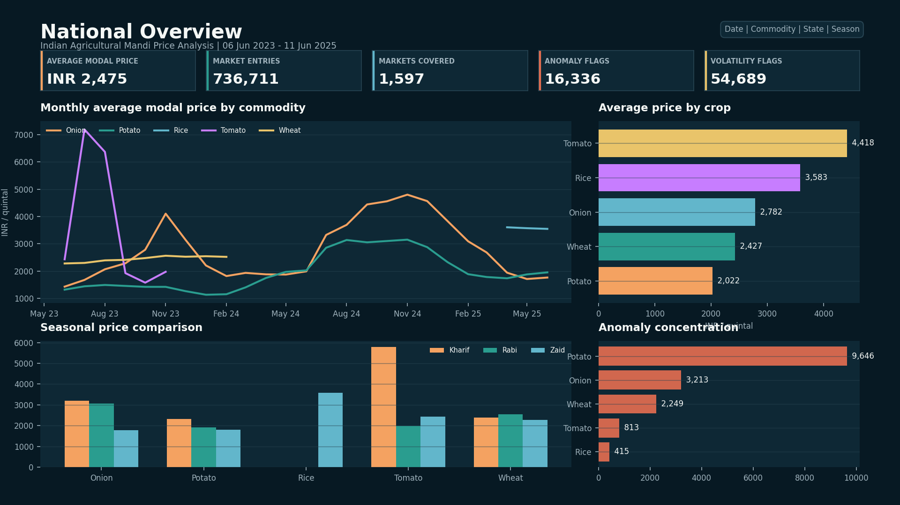
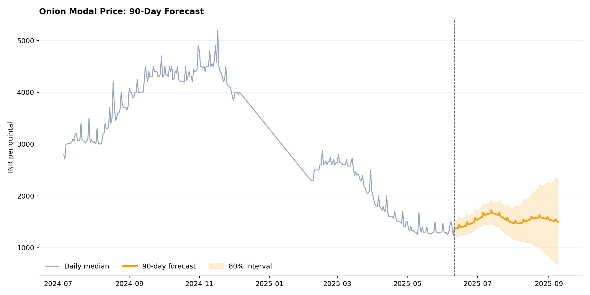
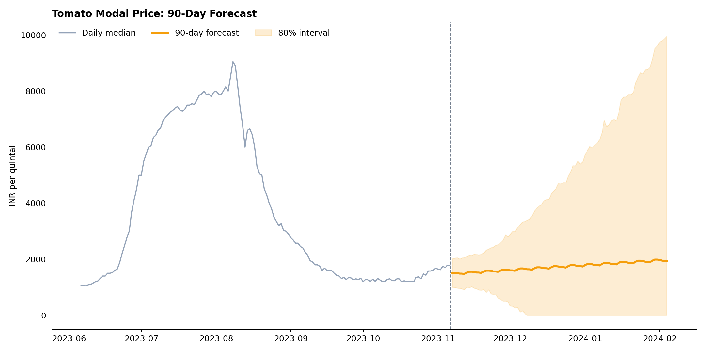
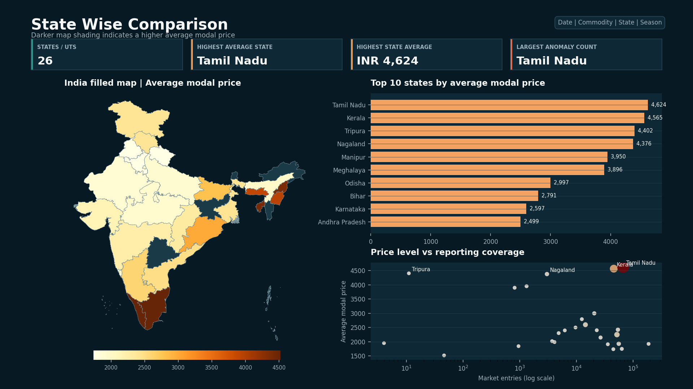
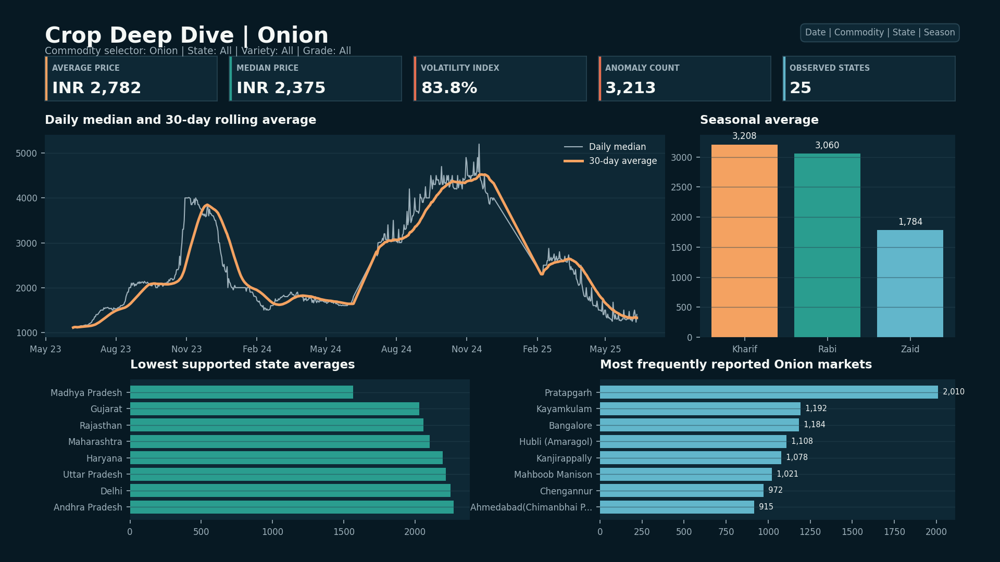
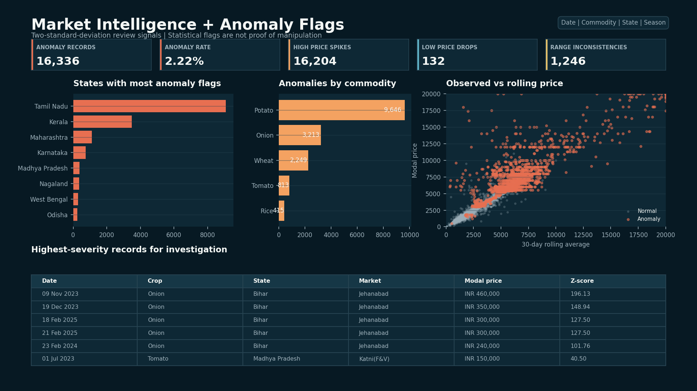

# 🌾 Indian Agricultural Mandi Price Intelligence

An interview-ready analytics portfolio that turns **736,711** Indian mandi price
quotes into a reproducible Python and SQLite pipeline, a documented four-page
Power BI report, anomaly investigations, Prophet forecasts, automated
plain-English insights, and a responsive multi-page project website.

<p align="center">
  <a href="https://sarwagyashah.github.io/mandi-price-dashboard/"><strong>🔗 View Live Website</strong></a>
  &nbsp;·&nbsp;
  <a href="https://github.com/SARWAGYASHAH/mandi-price-dashboard"><strong>📂 View Repository</strong></a>
</p>

---



## 📌 Problem Statement

Agricultural price quotes vary across crops, markets, states, seasons,
varieties, grades, and reporting practices. This project answers four practical
questions:

1. Which crops, states, and markets are relatively expensive or cheap?
2. How do prices move over time and across crop seasons?
3. Which records are statistically unusual enough to investigate?
4. How well can a baseline time-series model forecast Onion and Tomato prices?

## 📊 Dataset

The supplied master CSV is `data/raw/Agriculture_price_dataset.csv`. It
contains State, District, Market, Commodity, Variety, Grade, Price Date,
Min Price, Max Price, and Modal Price. Only **Onion, Tomato, Potato, Wheat, and
Rice** are retained.

No publisher URL or source-provenance metadata was included with the provided
file, so this repository does not claim a public origin it cannot verify.
Raw and large generated CSV files are intentionally ignored by Git.

### Cleaned Coverage

| Metric | Value |
|---|---:|
| Valid quote records | 736,711 |
| Date range | 6 June 2023 to 11 June 2025 |
| Commodities | 5 |
| Canonical states / union territories | 26 |
| Distinct market labels | 1,597 |
| Statistical anomaly flags | 16,336 (2.22%) |

## 🛠️ Tools & Technologies

| Tool | Purpose |
|---|---|
| **Python** | pandas, NumPy, Matplotlib, scikit-learn for data processing |
| **Prophet** | Time-series forecasting with weekly and yearly seasonality |
| **SQLite** | Structured queries, rankings, and reproducible CSV exports |
| **Power BI** | Star schema, 18 DAX measures, 4-page interactive dashboard |
| **HTML/CSS/JS** | 5-page responsive website with WebGL shader background |
| **GitHub Pages** | Live deployment of the project portfolio website |

## 📁 Project Structure

```text
mandi-price-dashboard/
├── data/
│   ├── raw/Agriculture_price_dataset.csv
│   ├── cleaned/
│   │   ├── mandi_cleaned_master.csv
│   │   └── cleaning_report.json
│   ├── outputs/
│   │   ├── anomaly_report.csv
│   │   ├── onion_forecast.csv
│   │   └── tomato_forecast.csv
│   └── mandi_prices.db
├── scripts/
│   ├── common.py
│   ├── data_cleaning.py
│   ├── anomaly_detection.py
│   ├── forecast_model.py
│   ├── automated_insights.py
│   ├── generate_dashboard_previews.py
│   └── run_pipeline.py
├── sql/
│   ├── queries.sql
│   └── query_results/
├── powerbi/
│   ├── data_model.md
│   ├── dax_measures.md
│   ├── dashboard_blueprint.md
│   └── dashboard_screenshots/
│       ├── page1.png
│       ├── page2.png
│       ├── page3.png
│       └── page4.png
├── visuals/
│   ├── onion_forecast.png
│   └── tomato_forecast.png
├── insights/
│   ├── anomaly_summary.md
│   ├── automated_insights.txt
│   ├── forecast_accuracy.md
│   └── key_findings.md
├── docs/
│   ├── index.html
│   ├── dashboard.html
│   ├── insights.html
│   ├── forecast.html
│   ├── about.html
│   ├── shared.css
│   ├── shared.js
│   └── assets/
├── requirements.txt
└── README.md
```

## 🔬 Methodology

### 1. Data Cleaning

`scripts/data_cleaning.py` standardizes headers, filters the five target crops,
parses dates and prices, removes non-positive and internally invalid ranges,
deduplicates records, and canonicalizes known geography variants such as
`Tamilnadu` to `Tamil Nadu` and `Orissa` to `Odisha`.

**Missing-data policy:**

- Critical geography, date, commodity, and price values are required.
- Blank Variety and Grade values become `Unknown`.
- Non-positive prices and rows where maximum is below minimum are removed.
- Modal prices outside the stated minimum-to-maximum range are retained and
  flagged because they may be either source errors or genuine unusual quotes.

Derived features include Year, Month, Quarter, Season, Price Range, a
market-level 30-day rolling average, a 30% volatility flag, commodity z-score,
and a two-standard-deviation anomaly flag. Exact row decisions are written to
`data/cleaned/cleaning_report.json`.

### 2. SQL Layer

`sql/queries.sql` imports the cleaned CSV through a text staging table, creates
a typed and indexed `mandi_prices` table, and exports eight result sets:

- State and commodity average prices
- Top and bottom ten markets
- Monthly crop aggregation
- Season comparison
- Anomaly records
- State price ranking
- Year-over-year commodity change

### 3. Power BI

The report uses `MandiPrices` as a quote-level fact table and `DimDate` as an
active one-to-many date dimension. The complete model, DAX, formatting,
interactions, and exact four-page visual inventory are documented in
`powerbi/`.

The committed PNGs are data-backed build previews generated with Matplotlib.
They are not presented as a `.pbix` export.

### 4. Anomaly Detection

Each modal price is compared with its commodity mean and standard deviation.
A z-score above 2 is a **High Price Spike** and below -2 is a **Low Price
Drop**. This flags 16,336 records: 16,204 high spikes and 132 low drops.
Potato contributes 9,646 flags, Tamil Nadu contributes 9,085, and November has
the highest monthly count at 3,428.

A flag is an investigation signal, not evidence of manipulation. Arrival
quantity, grade, weather, trader, auction, and enforcement data are required
for causal or misconduct claims.

### 5. Forecasting

Onion and Tomato quotes are aggregated to a national daily median. Prophet
uses weekly seasonality and multiplicative seasonal effects; yearly
seasonality is enabled only where at least 365 days of history exist.

Evaluation uses a chronological holdout of up to 90 observed days, capped at
20% of the series with a 30-day minimum. No future holdout observations are
used to fill training gaps.

| Commodity | MAE (INR/qtl) | RMSE (INR/qtl) | MAPE | Holdout |
|---|---:|---:|---:|---|
| Onion | 1,274.95 | 1,350.87 | 86.52% | 90 observations |
| Tomato | 1,087.84 | 1,185.04 | 74.84% | 31 observations |

The errors are high, so these forecasts are transparent analytical baselines,
not operational trading models. Tomato observations end on 6 November 2023;
its exported forecast is therefore a historical modeling artifact relative to
the full dataset.

#### Onion — 90 Day Forecast



#### Tomato — 90 Day Forecast



## 🔑 Key Findings

1. **Onion is the most volatile crop:** coefficient of variation is 83.81%.
2. **Seasonality is strongest for Tomato:** Kharif average price is 193.7%
   above Rabi.
3. **Low-cost sourcing is crop-specific:** Madhya Pradesh is cheapest for
   Onion and Tomato among states with at least 30 quotes, while Punjab is
   cheapest for Potato.
4. **Extreme market gaps require validation:** Patna (Musallahpur) averages
   INR 44,409.68 across 31 records, far above the overall INR 2,474.96 average.
5. **Quality and anomaly checks converge:** 16,336 statistical flags and 1,246
   modal prices outside their stated range identify focused audit priorities.

Detailed interpretation is in [insights/key_findings.md](insights/key_findings.md).

## 📈 Dashboard Pages

| Page | Purpose |
|---|---|
| National Overview | KPIs, crop trends, seasonality, and anomaly mix |
| State Wise Comparison | India filled map, state ranking, and reporting coverage |
| Crop Deep Dive | Rolling trend, seasonal profile, and market comparison |
| Market Intelligence | Anomaly concentration and record-level investigation |

### Page 1 — National Overview


### Page 2 — State Wise Comparison + India Map



### Page 3 — Crop Deep Dive



### Page 4 — Market Intelligence + Anomaly Flags



## 🌐 Project Website

The project includes a 5-page responsive portfolio website deployed on GitHub Pages:

| Page | Description |
|---|---|
| **Home** | Hero section, metrics counters, problem statement, toolchain, and key findings |
| **Dashboard** | All four Power BI page previews with DAX measure summaries and data model |
| **Insights** | Key findings cards, automated terminal-style insights, anomaly tables |
| **Forecast** | Prophet methodology pipeline, forecast charts with error metrics |
| **About** | Architecture, technology stack, project structure, methodology, and author |

**Design features:**
- WebGL shader animated background with saffron, teal, and blue orbs
- Glassmorphism dark theme with frosted-glass panels
- Animated counters, scroll-reveal transitions, and hover effects
- Fully responsive with mobile hamburger menu
- Inter + JetBrains Mono typography

## 🚀 Run the Project

Prerequisites: Python 3.11 or newer, pip, and the SQLite command-line shell.

```bash
python -m venv .venv
```

Windows PowerShell:

```powershell
.\.venv\Scripts\Activate.ps1
pip install -r requirements.txt
python scripts/run_pipeline.py
```

Manual execution:

```bash
python scripts/data_cleaning.py
sqlite3 -batch data/mandi_prices.db ".read sql/queries.sql"
python scripts/anomaly_detection.py
python scripts/forecast_model.py
python scripts/automated_insights.py
python scripts/generate_dashboard_previews.py
```

The dashboard preview generator downloads the India state-boundary GeoJSON
published by the [DataMeet maps project](https://github.com/datameet/maps) at
runtime. The website assets are copies of generated previews and forecasts.

To preview the website:

```bash
python -m http.server 8000
```

Open `http://localhost:8000/docs/`.

## 👤 Author

**Sarwagya Shah**

- GitHub: [SARWAGYASHAH](https://github.com/SARWAGYASHAH)
- Repository: [mandi-price-dashboard](https://github.com/SARWAGYASHAH/mandi-price-dashboard)
